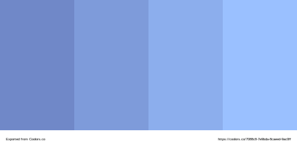
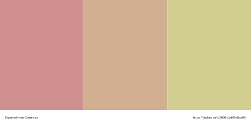

# Adech Theme for Visual Studio Code

Inspired by **loneliness**, to think about our nature and things we cannot explain.

## Scheme
#### Interface colors

#### Syntax colors

#### Complement colors

## Installation and Use
**Adech Theme** is already available in VSC Extensions.

To install it, just go to VSCode > Extensions > Adech Theme.

## How to contribute
Everyone is free to fork, make changes and fix issues 😄.
